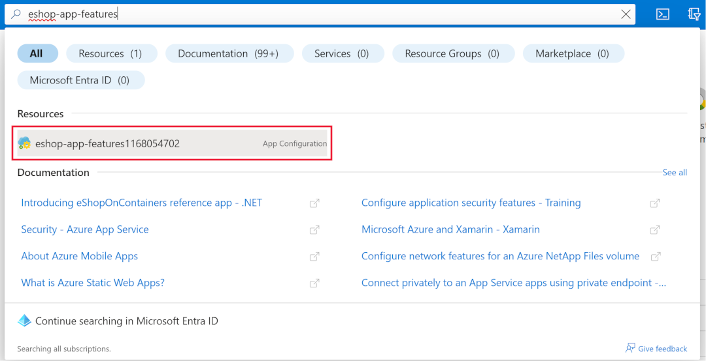
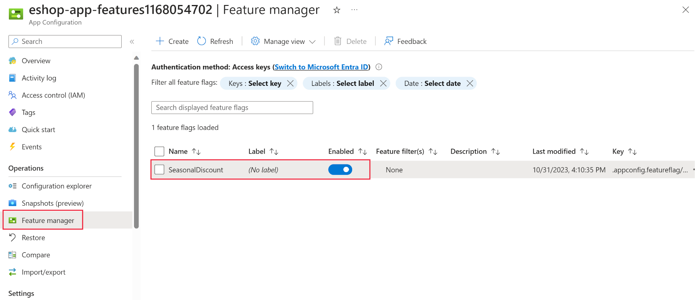
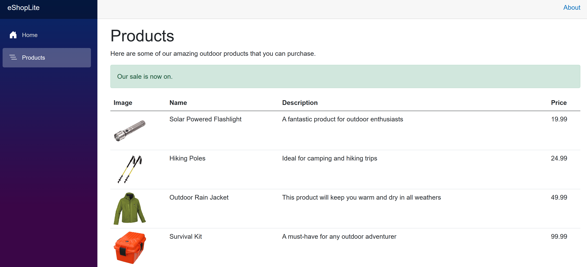

# End-to-End Azure/.NET: Fullstack, Data, & AI

Build end-to-end expertise to design, build, and operate scalable .NET and Azure solutions with data and AI; deliver a portfolio-ready project and be job-ready across full‑stack, data engineering, and solution architecture roles.

## Build cloud‑ready services with .NET

### Implement feature flags in a cloud-native ASP.NET Core microservices app

#### Introduction

`Unit 1/5`
Imagine you're a software developer for an online retailer. The retailer's online storefront is a cloud-native, microservices-based ASP.NET Core app. You've been asked to add the ability to the app to have seasonal sales. The sales and the discounts need to be controlled by the sales team, so that app can't be recompiled or redeployed to see the changes.

This module guides you through implementing a feature flags library. This library creates a feature flag to toggle the visibility of the seasonal sale. The configuration values that support this feature flag are centralized by using the Azure App Configuration service.

You use your own Azure subscription to deploy the resources in this module. If you don't have an Azure subscription, create a [free account](https://azure.microsoft.com/en-us/pricing/purchase-options/azure-account?cid=msft_learn) before you begin.

>[!IMPORTANT]
>To avoid unnecessary charges in your Azure subscription, be sure to delete your Azure resources when you're done with this module.

##### Development Container

This module includes configuration files that define a [development container](https://containers.dev/), or *dev container*. Using a dev container ensures a standardized environment that's preconfigured with the required tools.

The dev container can run in either of two environments. Before you begin, follow the steps in one of the following links to set up your environment, including installing Docker and the necessary Visual Studio Code extensions.

* [Visual Studio Code and a supported Docker environment on your local machine.](https://learn.microsoft.com/en-us/training/modules/use-docker-container-dev-env-vs-code/)
* [GitHub Codespaces (costs may apply).](http://github.com/features/codespaces)

##### Learning Objectives

* Review ASP.NET Core app configuration concepts.
* Implement real-time feature toggling with the .NET Feature Management library.
* Implement a centralized Azure App Configuration store.
* Implement code to use features and configuration settings from the Azure App Configuration store.

##### Prerequisites

* Familiarity with C# and ASP.NET Core development at the beginner level.
* Familiarity with RESTful service concepts at the beginner level.
* Conceptual knowledge of containers.
* Access to an Azure subscription with **Owner** privilege.
* Ability to run development containers in Visual Studio Code or GitHub Codespaces.

#### Review app configuration concepts

`Unit 2/5`

Creating microservices for a distributed environment presents a significant challenge. Cloud-hosted microservices often run in multiple containers in various regions. Implementing a solution that separates each service's code from configuration eases the triaging of issues across all environments.

In this unit, explore how to integrate ASP.NET Core and Docker configuration features with Azure App Configuration to tackle this challenge in an effective way.

You'll review the:

* ASP.NET Core configuration infrastructure.
* Kubernetes configuration abstraction—the ConfigMap.
* Azure App Configuration service.
* .NET Feature Management library.
* Feature flag components implemented in the app.

##### ASP.NET Core Configuration

Configuration in an ASP.NET Core project is contained in one or more .NET *configuration providers*. A [configuration provider](https://learn.microsoft.com/en-us/aspnet/core/fundamentals/configuration/?view=aspnetcore-10.0#configuration-providers) is an abstraction over a specific configuration source, such as a JSON file. The configuration source's values are represented as a collection of key-value pairs.

An ASP.NET Core app can register multiple configuration providers to read settings from various sources. With the default application host, several configuration providers are automatically registered. The following configuration sources are available in the order listed:

* JSON file (*appsettings.json*)
* JSON file (*appsettings.{environment}.json*)
* User secrets
* Environment variables
* Command line

Each configuration provider can contribute its own key value. Furthermore, any provider can override a value from a provider that was registered earlier in the chain than itself. Given the registration order in the preceding list, a `UseFeatureManagement` command-line parameter overrides a `UseFeatureManagement` environment variable. Likewise, a `UseFeatureManagement` key within *appsettings.json* can be overridden by a `UseFeatureManagement` key stored in *appsettings.Development.json*.

Configuration key names can describe a hierarchy. For example, the notation **eShop:Store:SeasonalSale** refers to the **SeasonalSale** feature within the **Store** microservice of the **eShop** app. This structure can also map configuration values to an object graph or an [array](https://learn.microsoft.com/en-us/aspnet/core/fundamentals/configuration/?view=aspnetcore-10.0#bind-an-array).

>[!IMPORTANT]
> Some platforms don't support a colon in environment variable names. To ensure cross-platform compatibility, a double underscore (__) is used instead of a colon (:) to delimit keys. For example, eShop__Store__SeasonalSale is the cross-platform equivalent notation for eShop:Store:SeasonalSale.

ASP.NET Core uses a [ConfigurationBinder](https://learn.microsoft.com/en-us/dotnet/api/microsoft.extensions.configuration.configurationbinder?view=net-11.0-pp) to map configuration values to objects and arrays. The mapping to key names occurs in a case-insensitive fashion. For example, `ConnectionString` and `connectionstring` are treated as equivalent keys. For more information, see [keys and values](https://learn.microsoft.com/en-us/aspnet/core/fundamentals/configuration/?view=aspnetcore-10.0#configuration-keys-and-values).

##### Docker Configuration

In Docker, one abstraction to handle configuration as a key-value pairs collection is the environment variable section of a container's YAML file. The following snippet is an excerpt from the app's `docker-compose.yml` file:

```dockerfile
services: 

  frontend:
    image: storeimage
    build:
      context: .
      dockerfile: DockerfileStore
    environment: 
      - ProductEndpoint=http://backend:8080
      - ConnectionStrings:AppConfig=Endpoint=https://eshop-app-features.azconfig.io;Id=<ID>;Secret=<SECRET>
    ports:
      - "32000:8080"
    depends_on: 
      - backend
```

The file snippet defines:

* Variables stored in the `environment` section of the YAML file, as highlighted in the preceding snippet.
* Presented to the containerized app as environment variables.
* A mechanism to persist .NET configuration values in microservices apps.

Environment variables are a cross-platform mechanism for providing runtime configuration to apps hosted in the Docker containers.

##### Azure App Configuration

A centralized configuration service is especially useful in microservices apps and other distributed apps. This module introduces Azure App Configuration as a service for centrally managing configuration values—specifically for feature flags. The service eases the troubleshooting of errors that arise when configuration is deployed with an app.

App Configuration is a fully managed service that encrypts key values both at rest and in transit. Configuration values stored with it can be updated in real time without the need to redeploy or restart an app.

In an ASP.NET Core app, Azure App Configuration is registered as a configuration provider. Aside from the provider registration, the app doesn't know about the App Configuration store. Configuration values can be retrieved from it via .NET's configuration abstraction—the `IConfiguration` interface.

##### Feature Management Library

The *Feature Management* library provides standardized .NET APIs for managing feature flags within apps. The library is distributed via NuGet in the form of two different packages named `Microsoft.FeatureManagement` and `Microsoft.FeatureManagement.AspNetCore`. The latter package provides Tag Helpers for use in an ASP.NET Core project's Razor files. The former package is sufficient when the Tag Helpers aren't needed or when not using with an ASP.NET Core project.

The library is built atop `IConfiguration`. For this reason, it's compatible with any .NET configuration provider, including the provider for Azure App Configuration. Because the library is decoupled from Azure App Configuration, integration of the two is made possible via the configuration provider. Combining this library with Azure App Configuration enables you to dynamically toggle features without implementing supporting infrastructure.

###### Integration with Azure App Configuration

To understand the integration of Azure App Configuration and the Feature Management library, see the following excerpt from an ASP.NET Core project's `Program.cs` file:

```csharp
string connectionString = builder.Configuration.GetConnectionString("AppConfig");

// Load configuration from Azure App Configuration
builder.Configuration.AddAzureAppConfiguration(options => {
  options.Connect(connectionString)
    .UseFeatureFlags();
});
```

In the preceding code fragment:

* The app's `builder.Configuration` method is called to register a configuration provider for the Azure App Configuration store. The configuration provider is registered via a call to `AddAzureAppConfiguration`.
* The Azure App Configuration provider's behavior is configured with the following options:
    * Authenticate to the corresponding Azure service via a connection string passed to the `Connect` method call. The connection string is retrieved from the `connectionString` variable. The registered configuration sources are made available via `builder.Configuration`.
    * Enable feature flags support via a call to `UseFeatureFlags`.
* The Azure App Configuration provider supersedes all other registered configuration providers because it's registered after any others.

>[!TIP]
>In an ASP.NET Core project, you can access the registered providers list by analyzing the configBuilder.Sources property inside of ConfigureAppConfiguration.

#### Exercise - Implement a feature flag to control ASP.NET Core app features

`Unit 3/5`

In this exercise, implement a feature flag to toggle a seasonal sales banner for your application. Feature flags allow you to toggle feature availability without redeploying your app.

You'll use the **Feature Management** in the .NET feature flag library. This library provides helpers to implement feature flags in your app. The library supports simple use cases like conditional statements to more advanced scenarios like conditionally adding routes or action filters. Additionally, it supports feature filters, which allow you to enable features based on specific parameters. Examples of such parameters include a window time, percentages, or a subset of users.

In this unit, you will:

* Create an Azure App Configuration instance.
* Add a feature flag to the App Configuration store.
* Connect your app to the App Configuration store.
* Amend the application to use the feature flag.
* Change the products page to display a sales banner.
* Build and test the app.

##### Open the development environment

You can choose to use a GitHub codespace that hosts the exercise, or complete the exercise locally in Visual Studio Code.

To use a **codespace**, create a preconfigured GitHub Codespace with [this Codespace creation link](http://github.com/codespaces/new/MicrosoftDocs/mslearn-dotnet-cloudnative?devcontainer_path=.devcontainer%2Fdotnet-feature-flags%2Fdevcontainer.json).

GitHub takes several minutes to create and configure the codespace. When it's finished, you see the code files for the exercise. The code that's used for the remainder of this module is in the **/dotnet-feature-flags** directory.

To use **Visual Studio Code**, clone the <https://github.com/MicrosoftDocs/mslearn-dotnet-cloudnative> repository to your local machine. Then:

1. Install any [system requiements](https://code.visualstudio.com/docs/devcontainers/containers) to run Dev Container in Visual Studio Code.
2. Make sure Docker is running.
3. In a new Visual Studio Code window open the folder of the cloned repository
4. Press `Ctrl+Shift+P` to open the command palette.
5. Search: **>Dev Containers: Rebuild and Reopen in Container**
6. Select **eShopLite - dotnet-feature-flags** from the drop down. Visual Studio Code creates your development container locally.

##### Create an App Configuration instance

Complete the following steps to create an App Configuration instance in your Azure subscription:

1. In the new terminal pane, sign in to the Azure CLI.

    ```azurecli
    az login --use-device-code
    ```

2. View your selected Azure subscription.

    ```azurecli
    az account show -o table
    ```

    If the wrong subscription is selected, select the correct one using the [az account set](https://learn.microsoft.com/en-us/cli/azure/account?view=azure-cli-latest#az-account-set) command.

3. Run the following Azure CLI command to get a list of Azure regions and the Name associated with it:

    ```azurecli
    az account list-locations -o table
    ```

    Locate a region closest to you and use it in the next step to replace `[Closest Azure region]`

4. Run the following Azure CLI commands to create an App Configuration instance:

    ```azurecli
    export LOCATION=[Closest Azure region]

    export RESOURCE_GROUP=rg-eshop
    export CONFIG_NAME=eshop-app-features$SRANDOM
    ```

    You need to change the **LOCATION** to an Azure region close to you, for example **eastus**. If you'd like a different name for your resource group or app configuration change the values above.

5. Run the following command to create the Azure Resource Group:

    ```azurecli
    az group create --name $RESOURCE_GROUP --location $LOCATION
    ```

6. Run the following command to create an App Configuration instance:

    ```azurecli
    az appconfig create --resource-group $RESOURCE_GROUP --name $CONFIG_NAME --location $LOCATION --sku Free
    ```

    A variation of the following output appears:

    ```json
    {
        "createMode": null,
        "creationDate": "2023-10-31T15:40:10+00:00",
        "disableLocalAuth": false,
        "enablePurgeProtection": false,
        "encryption": {
            "keyVaultProperties": null
        },
        "endpoint": "<https://eshop-app-features1168054702.azconfig.io>",
            "id": "/subscriptions/aaaa0a0a-bb1b-cc2c-dd3d-eeeeee4e4e4e/resourceGroups/rg-eshop/providers/Microsoft.AppConfiguration/configurationStores/eshop-app-features1168054702",
        "identity": null,
    }
    ```

7. Run this command to retrieve the connection string for the App Configuration instance:

    ```azurecli
    az appconfig credential list --resource-group $RESOURCE_GROUP --name $CONFIG_NAME --query [0].connectionString --output tsv
    ```

    This string prefixed with Endpoint= represents the App Configuration store's connection string.

8. Copy the connection string. You'll use it in a moment.

###### Store the App Configuration connection string

You'll now add the App Configuration connection string to the application. Complete the following steps:

1. Open the /dotnet-feature-flags/docker-compose.yml file.
2. Add a new environment variable at line 13.

    ```yml
    - ConnectionStrings:AppConfig=[PASTE CONNECTION STRING HERE]
    ```

    The docker-compose.yml will resemble the following YAML:

    ```yml
    environment: 
    - ProductEndpoint=<http://backend:8080>
    - ConnectionStrings:AppConfig=Endpoint=<https://eshop-app-features1168054702.azconfig.io;Id=><ID>;Secret=<Secret value>
    ```
    
The preceding line represents a key-value pair, in which `ConnectionStrings:AppConfig` is an environment variable name. In the *Store* project, the environment variables configuration provider reads its value.

>[!TIP]
>Your Azure App Configuration connection string contains a plain-text secret. In real world apps, consider integrating App Configuration with Azure Key Vault for secure storage of secrets. Key Vault is out of scope for this module, but guidance can be found at [Tutorial: Use Key Vault references in an ASP.NET Core app](https://learn.microsoft.com/en-us/azure/azure-app-configuration/use-key-vault-references-dotnet-core).

###### Add the Feature Flag to the App Configuration Store

In Azure App Configuration, create and enable a key-value pair to be treated as a feature flag. Complete the following steps:

1. In another browser tab, sign into the [Azure portal](https://portal.azure.com/?azure-portal=true#home) with the same account and directory as the Azure CLI.
2. Use the search box to find and open the App Configuration resource prefixed with **eshop-app-features**.

    
    
3. In the **Operations** section, select **Feature manager**.
4. In the top menu, select **+ Create**.
5. Select the **Enable feature flag** check box.
6. In the **Feature flag name** text box, enter **SeasonalDiscount**.
7. Select Apply.

    
    
    Now that the feature flag exists in the App Configuration store, the Store project requires some changes to read it.

##### Review code

Review the directories in the explorer pane in the IDE. Note that there's three projects **DataEntities**, **Products**, and **Store**. The **Store** project is the Blazor app. The **Products** project is a .NET Standard library that contains the product service. The **DataEntities** project is a .NET Standard library that contains the product model.

###### Connect your app to the App Configuration store

To access values from the App Configuration store in an ASP.NET Core app, the configuration provider for App Configuration is needed.

Apply the following changes to your **Store** project:

1. In the terminal window, navigate to the Store folder:

    ```bash
    cd dotnet-feature-flags/Store
    ```

2. Run the following command to install a NuGet package containing the .NET configuration provider for the App Configuration service:

    ```dotnetcli
    dotnet add package Microsoft.Azure.AppConfiguration.AspNetCore
    dotnet add package Microsoft.FeatureManagement.AspNetCore
    dotnet add package Microsoft.Extensions.Configuration.AzureAppConfiguration
    ```

3. Open the **Store/Program.cs** file.
4. Add the new package references at the top of the file:

    ```csharp
    using Microsoft.FeatureManagement;
    using Microsoft.Extensions.Configuration;
    using Microsoft.Extensions.Configuration.AzureAppConfiguration;
    ```

5. Add this code below the **// Add the AddAzureAppConfiguration** code comment.

    ```csharp
    // Retrieve the connection string
    var connectionString = builder.Configuration.GetConnectionString("AppConfig");

    // Load configuration from Azure App Configuration
    builder.Configuration.AddAzureAppConfiguration(options => {
        options.Connect(connectionString)
            .UseFeatureFlags();
    });

    // Register the Feature Management library's services
    builder.Services.AddFeatureManagement();
    builder.Services.AddAzureAppConfiguration();
    ```

    In the preceding code snippet:

    * The `Connect` method authenticates to the App Configuration store. Recall that the connection string is being passed as an environmental variable `ConnectionStrings:AppConfig`.
    * The `UseFeatureFlags` method enables the Feature Management library to read feature flags from the App Configuration store.
    * The two `builder.Services` calls register the Feature Management library's services with the app's dependency injection container.

6. At the bottom of the file, below **// Add the App Configuration middleware**, add this code:

    ```csharp
    app.UseAzureAppConfiguration();
    ```

    The preceding code adds the App Configuration middleware to the request pipeline. The middleware triggers a refresh operation for the Feature Management parameters for every incoming request. Then it's up to the `AzureAppConfiguration` provider to decide, based on refresh settings, when to actually connect to the store to get the values.

###### Enable a sales banner

Your app can now read the feature flag, but the products page needs to be updated to show that a sale is on. Complete the following steps:

1. Open the **Store/Components/Pages/Products.razor** file.
2. At the top of the file, add the following code:

    ```csharp
    @using Microsoft.FeatureManagement
    @inject IFeatureManager FeatureManager
    ```

    The preceding code imports the Feature Management library's namespaces and injects the `IFeatureManager` interface into the component.

3. In the **@code** section, add the following variable to store the state of the feature flag:

    ```csharp
    private bool saleOn = false;  
    ```

4. In the **OnInitializedAsync** method, add the following code:

    ```csharp
    saleOn = await FeatureManager.IsEnabledAsync("SeasonalDiscount");
    ```

    The method should look like the following code:

    ```csharp
    protected override async Task OnInitializedAsync()
    {
        saleOn = await FeatureManager.IsEnabledAsync("SeasonalDiscount");

        // Simulate asynchronous loading to demonstrate streaming rendering
        products = await ProductService.GetProducts();
    }
    ```

5. At line 26, under the comment, add the following code:

    ```razor
    <!-- Add a sales alert for customers -->
    @if (saleOn)
    {
    <div class="alert alert-success" role="alert">
        Our sale is now on.
    </div>
    }
    ```

    The preceding code displays a sales alert if the feature flag is enabled.

###### Build the app

1. Ensure you've saved all your changes, and are in the **dotnet-feature-flags** directory. In the terminal, run the following command:

    ```dotnetcli
    dotnet publish /p:PublishProfile=DefaultContainer 
    ```

2. Run the app using docker:

    ```bash
    docker compose up
    ```

###### Test the feature flag

To verify the feature flag works as expected in a codespace, complete the following steps:

1. Switch to the **PORTS** tab, then to the right of the local address for the **Front End** port, select the globe icon. The browser opens a new tab at the homepage.
2. Select **Products**.

If you're using Visual Studio Code locally, open <http://localhost:32000/products>.



In the Azure portal, you can enable and disable the feature flag and refresh the products page to see the flag in action.
